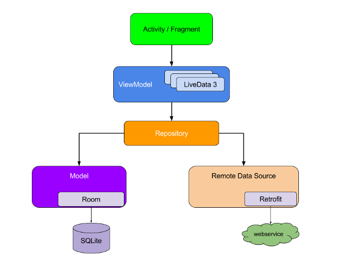

# Android Upwork Demo

Demo Android application using Gradle.
Project is written entirely in Kotlin with MVVM architecture

## Technologies Used

## Table Of Content
* [Structure](#structure)
* [Architecture](#architecture)
* [Dependencies](#dependencies)  
* [Building Application](#building-application)
    * [Clean](#clean)
    * [Debug](#debug)
    * [Release](#release)
    * [Test](#test)
* [Contributing](#contributing)    
* [License](#license)

## Structure

* `build.gradle` - root gradle config file
* `settings.gradle` - root gradle settings file
* `app` - our only project in this repo
* `app/build.gradle` - project gradle config file
* `app/src` - main project source directory
* `app/src/main` - main project flavour
* `app/src/main/AndroidManifest.xml` - manifest file
* `app/src/main/java` - java source directory
* `app/src/main/res` - resources directory
* `app/src/androidTest` - instrumented test source directory

## Architecture

## Dependencies
| **Dependency** | **Version** | **License** |
| -------------- | ----------- | ----------- |
| [Kotlin](https://kotlinlang.org/) | 1.6.20 | Apache |
| [Live Data](https://developer.android.com/kotlin/ktx#livedata) | 2.4.1 | Apache 2.0 |
| [ViewModel](https://developer.android.com/kotlin/ktx#viewmodel) | 2.4.1 | Apache 2.0 |
| [Navigation](https://developer.android.com/kotlin/ktx#navigation) | 2.4.1 | Apache 2.0 |
| [Room](https://developer.android.com/kotlin/ktx#room) | 2.4.2 | Apache 2.0 |
| [Retrofit](https://square.github.io/retrofit/) | 2.9.0 | Apache 2.0 |
| [Coil](https://github.com/coil-kt/coil) | 2.0.0-rc02 | Apache 2.0 |
| [Hilt](https://developer.android.com/training/dependency-injection/hilt-android) | 2.41 | Apache 2.0 |
| [Constraint Layout](https://developer.android.com/training/constraint-layout) | 2.1.3 | Apache 2.0 |
| [About Page](https://github.com/medyo/android-about-page) | 2.0.0 | MIT |

## Building Application

It is recommended that you run Gradle with the `--daemon` option, as starting
up the tool from scratch often takes at least a few seconds. You can kill the
java process that it leaves running once you are done running your commands.

Tasks work much like Make targets, so you may concatenate them. Tasks are not
re-done if multiple targets in a single command require them. For example,
running `assemble install` will not compile the apk twice even though
`install` depends on `assemble`.

#### Clean

	gradle clean

#### Debug

This compiles a debugging apk in `build/outputs/apk/` signed with a debug key,
ready to be installed for testing purposes.

	gradle assembleDebug

You can also install it on your attached device:

	gradle installDebug

#### Release

This compiles an unsigned release (non-debugging) apk in `build/outputs/apk/`.
It's not signed, you must sign it before it can be installed by any users.

	gradle assembleRelease

#### Test

Were you to add automated java tests, you could configure them in your
`build.gradle` file and run them within gradle as well.

	gradle test

#### Lint

This analyses the code and produces reports containing warnings about your
application in `build/outputs/lint/`.

	gradle lint

## Contributing
In order to contribute to this project please see the [contributing guidelines](CONTRIBUTING.md)

## License
This project is release under [GNU GPLv3 License](LICENSE)

